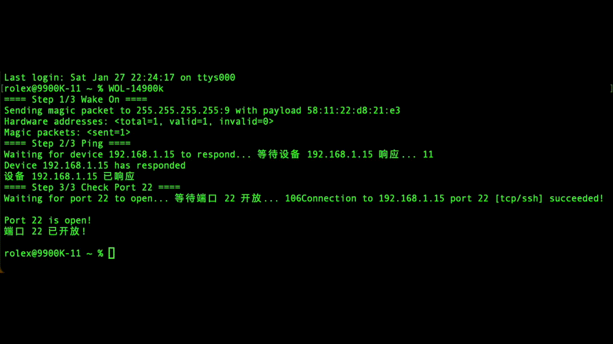
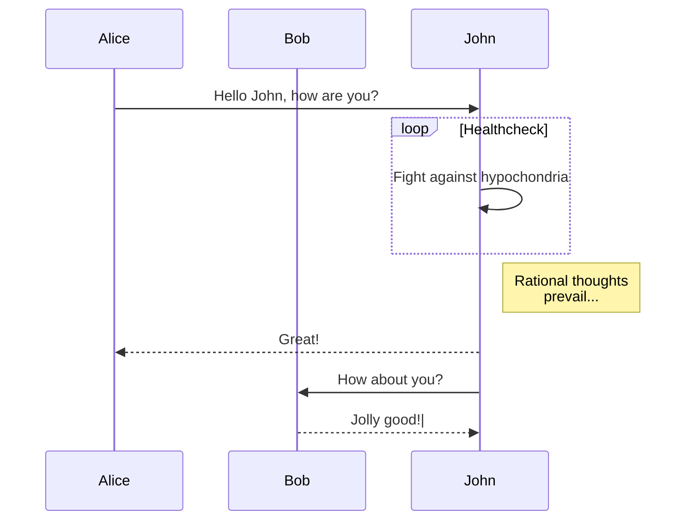

# WakeOn
<!--
WakeOn is a software program capable of awakening a target computer through a command executed within a local area network. Additionally, it can detect if the target computer has finished booting up and ascertain the readiness of specific ports.
WakeOn 是一个能够通过在局域网内执行命令来唤醒目标电脑的软件程序。此外，它还能检测目标电脑是否已完成启动，并确定特定端口的准备就绪状态。
-->

<!-- 
WakeOn is a software program capable of awakening a target computer through a command executed
within a local area network. Additionally, it can detect if the target computer has finished booting up
and ascertain the readiness of specific ports.
WakeOn 是一个能够通过在局域网内执行命令来唤醒目标电脑的软件程序。此外，它还能检测目标电脑是否已完
成启动，并确定特定端口的准备就绪状态。
Font: Merriweather
Font size: 30
Font color: #000000FF
Multiline: Each sentence on a new line
Width ✕ Height: 1500 ✕ 185
https://readme-typing-svg.herokuapp.com/demo/
-->

[](https://www.xaiat.com)
## Example: Wake On LAN for 14900k-1517 Workstation


*Wake On LAN for 14900k-1517.*


*A single track trail outside of Albuquerque, New Mexico.*




# 1.==== Create a New Script ====
The example path:
/Users/rolex/Code/WakeOn/WOL-14900k-1517.sh

```console
mkdir /Users/rolex/Code/WakeOn/
vim /Users/rolex/Code/WakeOn/WOL-14900k-1517.sh
```
```sh
#!/bin/bash

# 1. Wake up the device using wakeonlan
# 1. 使用 wakeonlan 唤醒设备
echo "==== Step 1/3 Wake On ===="
wakeonlan 58:11:22:d8:21:e3

# 2. Ping 192.168.1.15 and wait for the network response
# 2. Ping 192.168.1.15，并等待网络响应
echo "==== Step 2/3 Ping ===="
counter=0
start_time=$(date +%s)
while ! ping -c 1 192.168.1.15 &> /dev/null; do
    now=$(date +%s)
    counter=$((now - start_time))
    # Print waiting message without generating new lines, showing elapsed time in seconds
    # 打印等待消息，不产生新行，并显示经过的时间（秒）
    printf "\rWaiting for device 192.168.1.15 to respond... 等待设备 192.168.1.15 响应... %d" "$counter"
    sleep 1
done

# Move to a new line after the loop finishes
# 在循环结束后换行
printf "\n"

# Print response confirmation message
# 打印响应确认消息
echo "Device 192.168.1.15 has responded"
echo "设备 192.168.1.15 已响应"

# 3. Check if port 22 is open for SSH connection
# 3. 检测端口 22 是否开放，用于 SSH 连接
echo "==== Step 3/3 Check Port 22 ===="
counter=0
while true; do
    # Increment counter at the start of each loop
    # 在每次循环开始时增加计数器
    counter=$((counter+1))
    # Print waiting message without generating new lines, showing elapsed time in seconds
    # 打印等待消息，不产生新行，并显示经过的时间（秒）
    printf "\rWaiting for port 22 to open... 等待端口 22 开放... %d" "$counter"

    if nc -z 192.168.1.15 22; then
        # When connection succeeds, move to a new line and break the loop
        # 当连接成功时，换行并跳出循环
        printf "\n"
        break
    fi
    sleep 1
done

# Flash a message on the screen and make a sound when port 22 is open
# 当端口 22 开放时，在屏幕上发出闪烁提示，并发出声音提示
echo -e "\033[5mPort 22 is open!\033[0m"
echo -e "\033[5m端口 22 已开放!\033[0m"

# Make a sound alert
# 发出声音提示
echo -e "\a"

# Use other methods to make a sound if your terminal supports it
# 如果你的终端支持，也可以使用其他方式发出声音
# For example, `osascript -e 'beep'` for macOS
# 如：osascript -e 'beep'  # 仅适用于 macOS
# Or use any available command-line audio player to play a specific sound file
# 或使用任何可用的命令行音频播放工具播放特定的声音文件
```
# 2. ==== Permissions Command ====
```console
chmod +x /Users/rolex/Code/WakeOn/WOL-14900k-1517.sh
```
# 3. ==== Create a Symbolic Link ====
```console
sudo ln -s /Users/rolex/Code/WakeOn/WOL-14900k-1517.sh /usr/local/bin/WOL-14900k
```
# 4. ==== Use Script ====
```console
WOL-14900k
```
